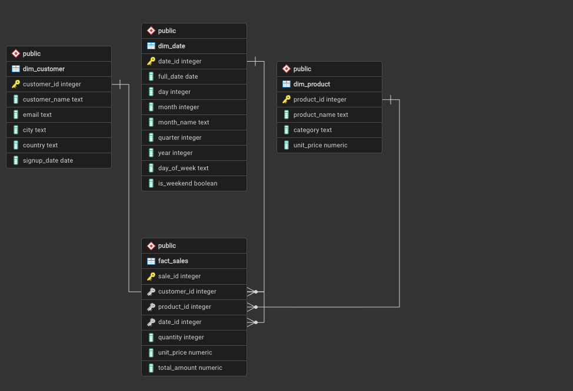
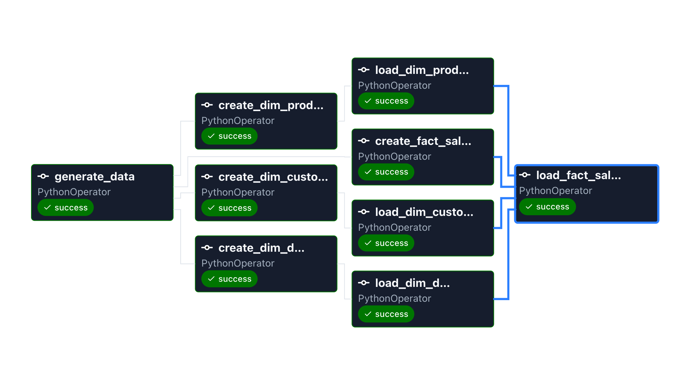

# Sales Data Warehouse

A demo Sales ETL pipeline that loads synthetic sales data into a PostgreSQL star schema, orchestrated with Apache Airflow. Data covers the full 2025 calendar year and is generated with a fixed seed for reproducible runs.
Stack

<p align="left">
  
  
  
  
  
  
</p>

## Star Schema



| Table | Role |
|---|---|
| `fact_sales` | Transaction facts — quantity, unit price, total amount |
| `dim_customer` | Customer attributes (name, email, location, signup date) |
| `dim_product` | Product catalog (name, category, unit price) |
| `dim_date` | Calendar attributes (day, month, quarter, weekend flag) |

`fact_sales` references all three dimensions via foreign keys. `date_id` uses an integer `YYYYMMDD` format (e.g. `20250630`).

## Pipeline

DAG: `sales_star_schema_pipeline` — runs daily via Airflow (`@daily`, catchup disabled).



1. **Generate** — Faker builds CSVs into `data/` (2k customers, 200 products, 365 date rows, 100k sales)
2. **Create** — DDL runs in parallel for all four tables (`CREATE TABLE IF NOT EXISTS`)
3. **Load dimensions** — bulk `COPY` into Postgres (dimensions load in parallel)
4. **Load fact** — waits until all dimensions are loaded before inserting rows (FK constraints)

Each task is a `PythonOperator` calling scripts under `data/`.

## Stack

- **Airflow 3.2** — Docker Compose with CeleryExecutor (scheduler, worker, Redis broker)
- **PostgreSQL** — `datawarehouse` DB for the star schema; `airflow_metadata` for Airflow state (local Postgres via `host.docker.internal`)
- **Python** — pandas, Faker, psycopg2


## Project Layout

```
dags/
  sales_dag.py          # Airflow DAG
  scripts/
    generate_data.py         # CSV generation
    create_tables.py         # DDL
    load_csv_postgres.py     # Bulk load via COPY
data/
  *.csv                    # Generated at runtime (see .gitignore)
docker-compose.yaml
Dockerfile
requirements.txt
```
